<div align="center">

# B V Hitesh Sai

```
$ whoami
```

**CS student · Apache Maven contributor · building toward GSoC, research, and grad school**

</div>

<br>

<!--
  Live terminal widget — generated automatically by the GitHub Action in
  .github/workflows/metrics.yml. Once you've run that workflow at least once
  (see the setup comments in that file), delete the two lines below this
  comment block and uncomment the  line to show your real metrics.
-->

```
$ ls github-metrics.svg
```

```text
ls: cannot access 'github-metrics.svg': run .github/workflows/metrics.yml first
```

<!-- <div align="center">
  
</div> -->

<br>

```
$ cat about.md
```

I'm a Computer Science student in India who spends more time reading dependency-resolution
code than tutorials. I got into open source because I wanted to understand how large,
production-grade codebases actually work — Apache Maven is the one that stuck.

I care about the unglamorous parts: tracing execution through five layers of abstraction
before writing a line, understanding *why* a build system makes the choices it does, and
getting a PR right rather than getting it fast.

<br>

```
$ cat current-focus.md
```

```text
role      Computer Science student, Sai Vidya Institute of Technology (VTU)
project   maven-dependency-tracker-plugin — dependency usage tracking for Maven 4
status    iterating on design, shipping PRs, engaging on dev@maven.apache.org
```

<br>

```
$ git log --oneline --all -- apache/maven
```

```text
12260  merged     [add one-line description]
12332  in review  feat: executable() profile activation function
12369  in review  [add one-line description]
```

**Currently in progress**
- Proposal to add in-memory dependency-usage tracking to the Maven resolver, plus a new SPI
  so packaging plugins (WAR as MVP) can report include/exclude decisions
- Analysis of stale branches across `apache/maven`, findings prepared for maintainers (issue `#11858`)

Getting a PR merged into Maven means convincing committers who've maintained the codebase
for over a decade. Every contribution here has to earn its place — that's exactly why it's
worth doing.

<br>

```
$ ls featured-projects/
```

<!-- TODO: swap in your best repos, one line each -->
```text
maven-dependency-tracker-plugin/    Maven 4 plugin tracking used vs. declared dependencies
network-packet-routing-visualizer/  Dijkstra's-based visualizer, algorithms coursework
[project-name]/                     [one-line description]
```

<br>

```
$ cat stack.json
```

<div align="center">


</div>

<br>

```
$ cat goals.md
```

```text
[ ] more merged PRs into Apache Maven, deeper into resolver/build-lifecycle internals
[ ] Google Summer of Code — Apache Software Foundation
[ ] LFX Mentorship
[ ] first research paper, likely growing out of the dependency-tracking work
[ ] strong SWE internship — infra / developer tooling
[ ] Master's — UC Berkeley / UCLA / Georgia Tech / USC or similar
[ ] long-term: build something of my own, take it through Y Combinator
```

<br>

```
$ tail -f fun-facts.log
```

```text
> commit history has more "fix typo in comment" entries than I'd like to admit
> corrected more assumptions by Apache committers in 4 months than in 4 years of coursework
> now reads mailing-list threads for fun — growth or red flag, unclear
```

<br>

```
$ cat contact.txt
```

<div align="center">

<!-- TODO: fill in real links -->
[](#)
[](#)
[](https://lists.apache.org/list.html?dev@maven.apache.org)

</div>

<br>

<div align="center">
<sub><code>$ █</code></sub>
</div>
